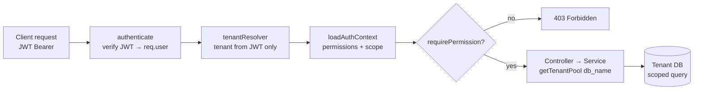
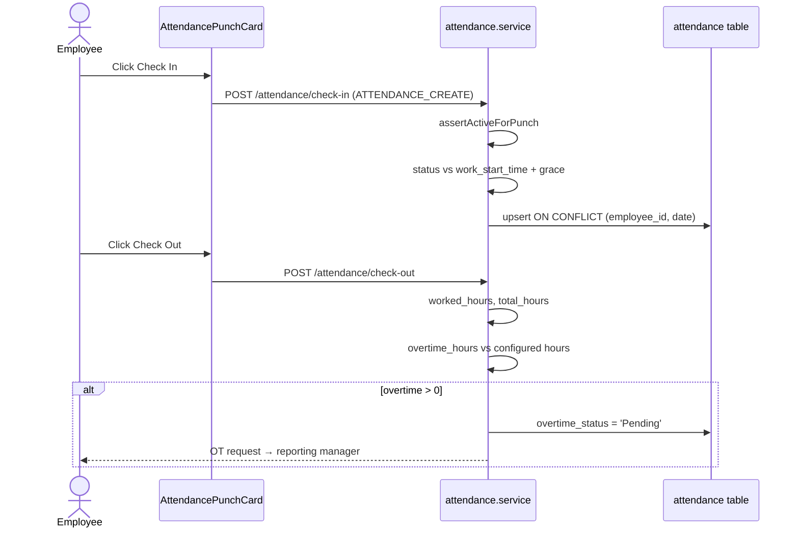
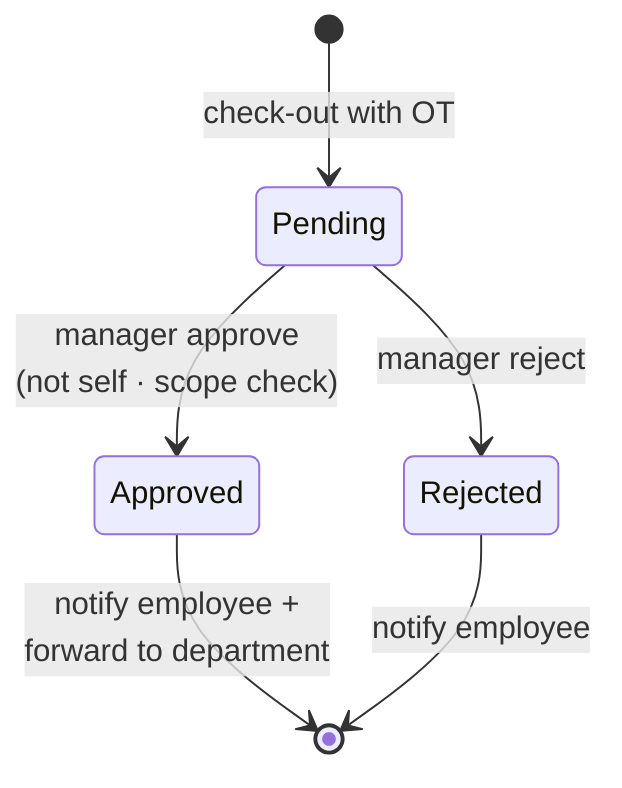
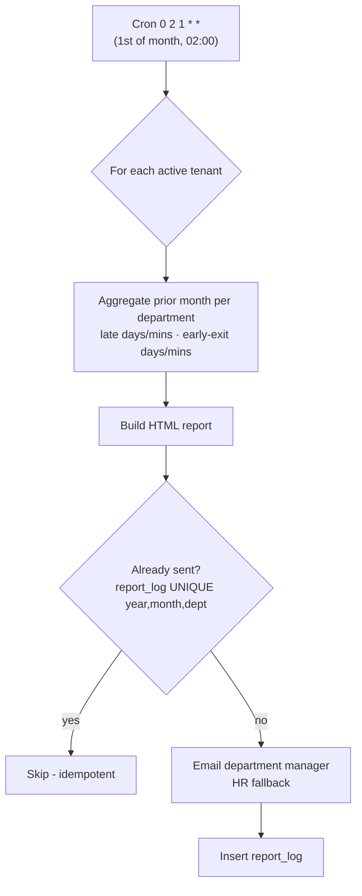
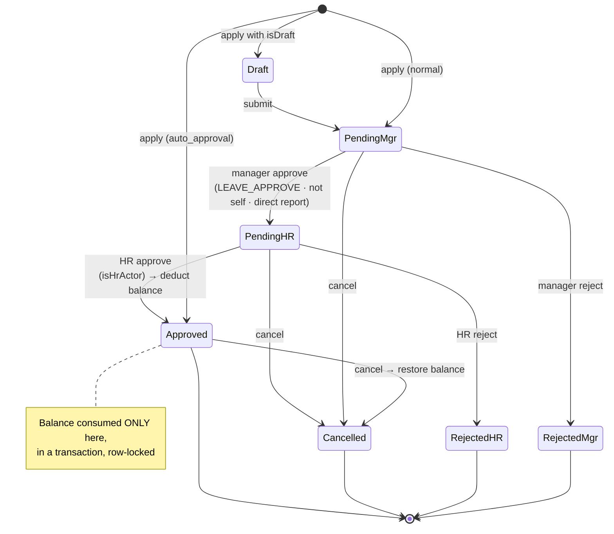
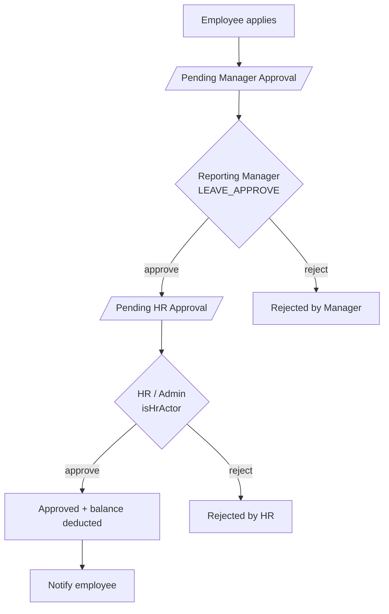
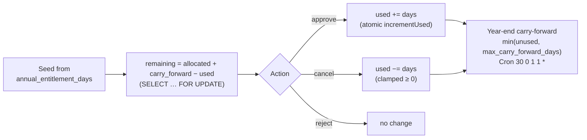
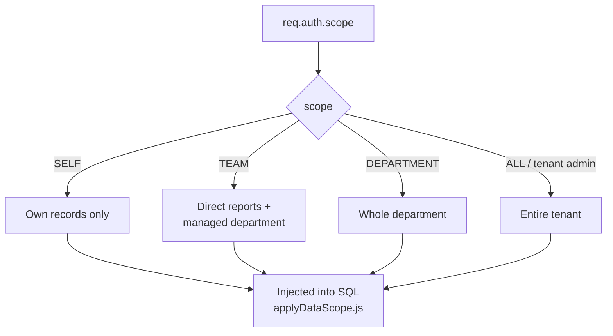

# Attendance & Leave — Visual Flows (Mermaid)

_Renders in GitHub and VS Code (Markdown Preview Mermaid Support). Companion to [ATTENDANCE_LEAVE_FLOW.md](ATTENDANCE_LEAVE_FLOW.md)._

---

## 1. Request lifecycle — multi-tenant + RBAC pipeline

---

## 2. Attendance — Check-In / Check-Out

---

## 3. Overtime approval

---

## 4. Late / early monthly report (cron)

---

## 5. Leave — application + two-stage approval

---

## 6. Leave approval — actors & routing

---

## 7. Leave balance lifecycle (concurrency-safe)

---

## 8. Data-scope visibility (who sees what)

